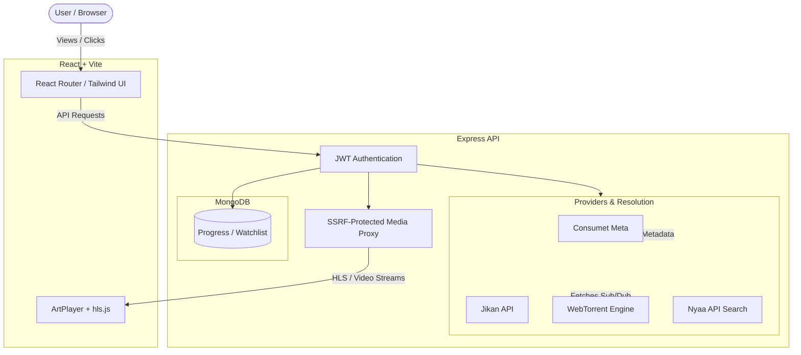

# Ataraxia

Ataraxia is a full-stack anime aggregation and streaming platform. It acts as a unified media orchestrator, taking metadata from external APIs and dynamically resolving playable media through direct HTTP streams or on-the-fly torrent processing. 

Built with React and Express, it provides a smooth, authenticated streaming experience that normalizes episode metadata, manages source resolution, proxies streaming content securely, and persists personal progress locally.

## Features

**Media Discovery**
- Search and browse Anime titles using AniList data.
- Aggregation of metadata and episode lists via Consumet and Jikan API.
- Unified resolution of external sources for playback.

**Playback**
- **HLS Playback**: Mediated HLS playlist proxying with segment forwarding.
- **Torrent-backed Streaming**: Real-time media extraction and streaming via WebTorrent over HTTP Range requests.
- **Source Fallback**: Graceful fallback from WebTorrent to direct providers if a stream is unavailable.
- Dynamic Subtitles and quality switching.
- Intro/Outro skipping powered by AniSkip.

**Personal State**
- Persistent local Watchlist.
- Continue Watching queue with resume progress tracking.
- Progress synchronization and MongoDB persistence.

## Architecture



### Frontend
- **React & TypeScript** compiled via **Vite**.
- Styled using **Tailwind CSS** and animated with **Framer Motion**.
- Uses **ArtPlayer** combined with **hls.js** to handle both direct `.mkv/.mp4` playback and `.m3u8` streams.
- State fetching through **Axios**.

### Backend
- **Node.js** with **Express** serving as a RESTful orchestration layer.
- Enforces strict **JWT Authentication**.
- **WebTorrent** integration for native torrent downloading, allowing torrent-backed files to be served via HTTP Range requests (HTTP 206 Partial Content).
- **SSRF-Resistant Media Proxy** intercepts and safely tunnels cross-origin media requests to bypass CORS limitations on the client while rejecting invalid hostnames.

### Persistence
- Uses **MongoDB** and **Mongoose**.
- Persists user watch progress, playback timestamps, and custom watchlists.
- Employs secure atomic database operations (`bulkWrite`, `upsert`) to maintain state consistency across stream interruptions.

---

## Source Selection / Torrent Resolution

Ataraxia implements a heuristic fallback architecture to determine the best streaming candidate for a selected episode.

1. **Episode Request**: The client requests an episode by its AniList mapping (e.g. `1161`).
2. **Metadata Resolution**: The system standardizes the anime title (Romanji/English) using AniList/Consumet.
3. **Candidate Generation**: The Torrent engine queries Nyaa for releases matching `[Title] [Episode] [Resolution]`.
4. **Filtering**: Invalid releases (movies when searching for TV episodes, batch downloads, incorrect codecs) are pruned.
5. **Scoring & Ranking**: 
   - Uses heuristic scoring based on `seeders`.
   - Massive confidence boosts (+10,000 score) are applied to trusted release groups (like `[SubsPlease]` and `[Erai-raws]`).
6. **Fallback**: If no high-quality torrents are available, it degrades gracefully to direct DDL providers (e.g. HiAnime).

## Streaming Architecture

### HLS Proxying
When an external `.m3u8` playlist is selected, the Express proxy acts as a secure intermediary. It intercepts playlist requests, validates the remote domain (SSRF protection), proxies the `.m3u8` content to the frontend, and ensures subsequent HLS TS segment requests correctly traverse through the authenticated proxy without exposing external host details to the browser.

### Torrent-backed HTTP Streaming
For natively torrented `.mkv/.mp4` media:
1. **WebTorrent Lifecycle**: The backend initializes a WebTorrent client and attaches the resolved magnet link.
2. **File Selection**: The largest media file within the torrent payload is actively prioritized.
3. **HTTP Range Streaming**: The Express streaming route implements standard `Range` headers, returning `206 Partial Content`. This tricks the browser into seeing the dynamically downloading torrent as a standard, seekable VOD file.

---

## Authentication & Security

- **JWT Authentication**: The API is entirely shielded behind JWT Bearer token authentication. Unauthenticated requests are rejected outright (`401 Unauthorized`).
- **Media Request Signing**: Since native HTML5 `<video>` tags and `hls.js` instances do not send headers, streaming URLs are securely signed by passing short-lived token query parameters that the authentication middleware dynamically respects.
- **SSRF Protection**: Any proxy request originating from the frontend undergoes strict URL validation. `localhost`, loopback addresses, `0.0.0.0`, and non-HTTP/S protocols are explicitly denied to prevent Server-Side Request Forgery attacks.
- **No TLS Verification Bypassing**: External TLS/SSL verification is fully enforced across all outbound proxy requests.

---

## Configuration

Environment variables are isolated in `.env` files which must not be committed to version control.

Reference the `.env.example` templates in both `client/` and `server/` directories.

| Variable | Scope | Purpose | Required |
|----------|--------|---------|----------|
| `VITE_API_BASE_URL` | Client | The URL of the Express API layer. | Yes |
| `PORT` | Server | Express API port. | Yes |
| `SERVER_PUBLIC_URL` | Server | Public URL prefix generated by the API for playable media streams. | Yes |
| `MONGODB_URI` | Server | Connection string for MongoDB. | Yes |
| `CORS_ORIGINS` | Server | Allowed origin URL for frontend API access. | Yes |
| `JWT_SECRET` | Server | Secret signing key for generating JWT tokens. | Yes |
| `APP_PASSWORD` | Server | Master login password. | Yes |
| `JIKAN_BASE_URL` | Server | Jikan (MyAnimeList) API base URL. | Yes |

---

## Local Development

### Prerequisites
- Node.js 20+
- npm (workspaces supported)
- MongoDB instance (local or Atlas)

### Installation
Clone the repository and install the dependencies from the project root. The workspace will handle both client and server installations.
```bash
git clone https://github.com/SiddharthAmdal/Ataraxia.git
cd Ataraxia
npm install
```

### Environment Setup
Create environment files from their examples:
```bash
cp server/.env.example server/.env
cp client/.env.example client/.env
```
Ensure you configure `JWT_SECRET`, `APP_PASSWORD`, and `MONGODB_URI` properly before launching.

### Running

The development server supports concurrent execution of both the Vite client and the Express backend using npm workspaces:

**Start the Frontend** (Runs on `http://localhost:5173`)
```bash
npm run dev:client
```

**Start the Backend** (Runs on `http://localhost:4000`)
```bash
npm run dev:server
```

---

## API Overview

The Express backend routes are compartmentalized based on domain logic:

- `/api/auth` — Handles login handshakes and JWT token issuance.
- `/api/media` — Facilitates external metadata fetching (search, popular, recent episodes, detailed show views).
- `/api/streaming` — Manages source resolution (Torrent / DDL), metadata tracking, and live media tunneling.
- `/api/progress` — Coordinates watch progress updates and the "Continue Watching" queue.
- `/api/watchlist` — Manages the user's localized anime tracking list.

---

## Repository Structure

```text
Ataraxia/
├── client/
│   ├── src/
│   │   ├── components/  # Reusable UI & ArtPlayer wrappers
│   │   ├── context/     # Auth and Progress React Contexts
│   │   ├── lib/         # Axios config, HTTP interceptors
│   │   ├── pages/       # React Router views
│   │   ├── services/    # API abstraction methods
│   │   └── types/       # TypeScript interfaces
│   └── ...
├── server/
│   ├── src/
│   │   ├── middlewares/ # Authentication routines
│   │   ├── models/      # Mongoose schemas (Progress, Watchlist)
│   │   ├── routes/      # Express controllers
│   │   ├── services/    # Metadata aggregation, Torrent processing
│   │   └── utils/       # Validation (SSRF), helpers
│   └── ...
└── package.json         # Workspace orchestration
```

---

## Testing & Verification

Currently, automated test coverage is not implemented. Verification relies on manual startup and routing inspections. 

**Verified Behaviors:**
- **Build Status**: The frontend `npm run build` strictly typechecks (`tsc -b`) and bundles securely.
- **SSRF Validation**: Malicious local proxy traversal attacks have been actively tested and blocked.
- **Authentication**: Route tampering, unauthenticated endpoints, and token hijacking have been validated against.
- **Streaming Pipeline**: Torrents stream successfully over HTTP-range requests while handling segment/chunking cleanly on modern browsers.

## Known Limitations
- The application relies heavily on third-party APIs (AniList, Nyaa). Availability and layout changes in these external providers may cause downstream playback or metadata resolution failures.
- No formal automated unit/integration testing suite is provided.
- Authentication utilizes a single-user master password model suitable for a personal application instance, rather than a multi-user distributed service design.

## Technical Highlights
- **Heuristic Source Ranking**: Standardizes unstructured metadata (Torrents) by prioritizing active seeders, validated release groups, and matching resolution codecs over a blind first-result return.
- **HTTP-Range Proxying**: By implementing standard HTTP `206 Partial Content` mechanics for actively downloading WebTorrents, the backend transparently tricks HTML5 players into native seeking.
- **Unified Media Interface**: Obfuscates whether media is playing directly from an HLS server, a raw proxy, or an active torrent by wrapping everything under an abstracted `/playback` endpoint schema.
